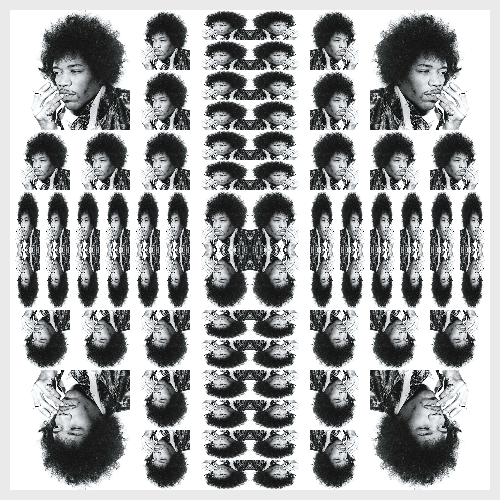

# Woodcut



Warning! Still experimental.

Clojure and Quil implementation of SICP'S version of Peter Henderson's picture
language for creating images like M.C. Escher's "Square Limit" woodcut.

SICP exercises 2.46 and 2.48 are needed to complete this implementation, and so
there are comments in the code where those exercises are solved. There's also an
alternative solution for 2.47.

## Namespaces

This implementation is divided into 3 namespaces:

### sicp.woodcut.vecs

Contains an abstraction to create and handle vectors and frames. There's a
`make-vector` constructor and `xcor-vect`/`ycor-vect` selectors for vectors
(2.46). There's a `make-frame` constructor and
`origin-frame`/`edge1-frame`/`edge2-frame` selectors for frames (2.47)

### sicp.woodcut.painters

Provides `segments->painter` and `image->painter` utility functions. There's
also an abstraction to handle segments, with `make-segment` creator and
`start-segment`/`end-segment` selectors (2.48).

This namespace also provides two painters to play with:

- `wave`: the book's segment painter.
- `jimi`: an image painter.

**Note**: `image->painter` is still experimental and does not work well when
mixed with `segments->painter`.

### sicp.woodcut.drawing

Provides the higher end API abstraction. It's main function is `draw`, which
when called with a `painter`, returns a Quil Sketch of it.

## Example

```clj
(require '[sicp.woodcut.painters :refer [segments->painter make-segment]])
(require '[sicp.woodcut.vecs :refer [make-vector]])
(require '[sicp.woodcut.drawing :refer [draw]])

(def x-painter
  (segments->painter (list
                      (make-segment (make-vector 0 0) (make-vector 1 1))
                      (make-segment (make-vector 1 0) (make-vector 0 1)))))

(draw x-painter)  ;; => Quil sketch drawing an X
```

## Extra stuff

More functions (like `flip-horiz`, `flip-vert`, `besides`, `below`,
`square-limit` and so on...) can be found on Chapter 2 exercises.
